# RAG-Powered Documentation Assistant

A production-ready backend system that provides AI-powered documentation assistance using Retrieval-Augmented Generation (RAG). The system fetches documentation from GitHub, processes it with LangChain's markdown-aware chunking, stores it in a Supabase vector database, and serves intelligent responses via a streaming API.

---

## 📋 Table of Contents

- [Architecture Overview](#architecture-overview)
- [System Components](#system-components)
- [Data Flow Diagrams](#data-flow-diagrams)
- [How It Works](#how-it-works)
- [Configuration](#configuration)
- [Usage](#usage)
- [Tech Stack](#tech-stack)

---

## 🏗️ Architecture Overview


---

## 🔧 System Components

### 1. **sync-docs.js** - Documentation Ingestion Pipeline

**Purpose**: Fetches, processes, and stores documentation in the vector database.

**Key Features**:
- ✅ Fetches MDX files from GitHub raw URLs
- ✅ Uses LangChain's markdown-aware text splitting
- ✅ Preserves document structure (headers, code blocks, lists)
- ✅ Transforms GitHub paths to Mintlify documentation URLs
- ✅ Generates embeddings via OpenAI
- ✅ Stores chunks with metadata in Supabase

### 2. **server.js** - RAG API Server

**Purpose**: Serves AI-powered documentation assistance with streaming responses.

**Key Features**:
- ✅ Express.js REST API with CORS support
- ✅ Vercel AI SDK compatible streaming format
- ✅ Vector similarity search for relevant documentation
- ✅ Context-aware chat completions
- ✅ Returns source URLs (Mintlify links)
- ✅ Maintains conversation history (last 5 messages)

### 3. **Supabase Database** - Vector Store

**Database Schema**:
```sql
CREATE TABLE documents (
  id TEXT PRIMARY KEY,              -- e.g., "docs/quickstart.mdx--chunk-0"
  title TEXT,                       -- e.g., "quickstart"
  url TEXT,                         -- e.g., "https://acme-80ce2022.mintlify.app/quickstart"
  content TEXT,                     -- Chunk content
  embedding vector(1536)            -- OpenAI text-embedding-3-small embedding
);

-- Vector similarity search function
CREATE OR REPLACE FUNCTION match_documents(
  query_embedding vector(1536),
  k INT DEFAULT 5
)
RETURNS TABLE (
  id TEXT,
  title TEXT,
  url TEXT,
  content TEXT,
  similarity FLOAT
)
```

---

## 📊 Data Flow Diagrams

### Sync Process Flow (sync-docs.js)

```mermaid
sequenceDiagram
    participant CLI as Developer
    participant SD as sync-docs.js
    participant GH as GitHub Raw API
    participant LC as LangChain Splitter
    participant OAI as OpenAI API
    participant DB as Supabase DB

    CLI->>SD: Run: node sync-docs.js

    SD->>SD: Load REPO_INDEX_URL
    SD->>GH: Fetch docs_index.txt
    GH-->>SD: List of 16 MDX files

    loop For each MDX file
        SD->>GH: Fetch raw MDX content
        GH-->>SD: MDX file content

        SD->>SD: Create LangChain Document<br/>with Mintlify URL metadata

        SD->>LC: Split using markdown separators
        LC-->>SD: ~13.6 chunks/file (avg)

        SD->>OAI: Generate embeddings (batch)
        OAI-->>SD: 1536-dim vectors

        loop For each chunk
            SD->>DB: Upsert(id, title, url, content, embedding)
            DB-->>SD: Success
        end
    end

    SD->>CLI: ✅ Done! 16 files → 217 chunks
```



**URL Transformation Example**:
```
Input:  docs/configuration/currencies.mdx
Output: https://acme-80ce2022.mintlify.app/configuration/currencies
```

---

### Chat API Flow (server.js)


**Streaming Format (Vercel AI SDK)**:
```
0:"Hello "
0:"I can "
0:"help with that!\n"
8:[{"type":"tool-invocation","toolInvocation":{"toolName":"search","result":[...]}}]
d:{"finishReason":"stop","usage":{...}}
```

---

## 🔍 How It Works

### LangChain Markdown-Aware Chunking

The system uses **RecursiveCharacterTextSplitter** with markdown-specific separators:

```javascript
RecursiveCharacterTextSplitter.fromLanguage("markdown", {
  chunkSize: 1200,      // Target chunk size
  chunkOverlap: 200,    // Overlap for context preservation
})
```

**Separator Priority** (tries in order):
1. `\n## ` - H2 headers (highest priority)
2. `\n### ` - H3 headers
3. `\n#### ` - H4 headers
4. `\n\n` - Paragraphs
5. `\n` - Lines
6. `. ` - Sentences
7. ` ` - Words
8. `` - Characters (last resort)

**Benefits**:
- ✅ Keeps related content together (e.g., complete code examples)
- ✅ Respects document structure
- ✅ Doesn't break mid-sentence or mid-code-block
- ✅ Better semantic coherence = better retrieval quality

---

### Vector Similarity Search

**How it works**:
1. User question: "How do I configure currencies?"
2. Convert question to embedding (1536-dim vector)
3. Calculate cosine similarity with all stored embeddings
4. Return top-K (5) most similar chunks
5. Use chunks as context for GPT-4o-mini

**Example**:
```
Question embedding: [0.023, -0.145, 0.892, ...]
                           ↓ Cosine similarity
Chunk 1: "Currency configuration..." → 0.87 (most similar)
Chunk 2: "Language settings..."      → 0.45
Chunk 3: "SEO optimization..."       → 0.23
                           ↓
Return top 5 for context
```

---

## ⚙️ Configuration

### Environment Variables

```bash
# Backend Configuration
OPENAI_API_KEY=sk-proj-...                    # OpenAI API key
SUPABASE_URL=https://xxx.supabase.co          # Supabase project URL
SUPABASE_SERVICE_ROLE_KEY=eyJhbGc...          # Supabase service role key

# Documentation Sync (sync-docs.js)
REPO_RAW_BASE=https://raw.githubusercontent.com/org/repo/main/
REPO_INDEX_URL=https://raw.githubusercontent.com/org/repo/main/docs_index.txt
MINTLIFY_BASE_URL=https://acme-80ce2022.mintlify.app

# Server
PORT=9000                                     # API server port (default: 9000)
```

### File Structure

```
backend3/
├── server.js              # RAG API server
├── sync-docs.js           # Documentation ingestion pipeline
├── package.json           # Dependencies
├── .env                   # Environment variables (gitignored)
├── .env.example           # Environment template
├── docs_index.txt         # List of documentation files
└── PROJECT_OVERVIEW.md    # This file
```

---

## 🚀 Usage

### 1. Install Dependencies

```bash
npm install
```

**Key Dependencies**:
- `express` - Web server
- `@supabase/supabase-js` - Database client
- `openai` - OpenAI API client
- `@langchain/textsplitters` - Markdown-aware text splitting
- `@langchain/core` - LangChain core utilities
- `node-fetch` - HTTP client for fetching docs

### 2. Sync Documentation to Vector Store

```bash
node sync-docs.js
```

**Expected Output**:
```
Found 16 files
Fetching https://raw.githubusercontent.com/.../currencies.mdx
  → Split into 17 chunks (Mintlify URL: https://acme-80ce2022.mintlify.app/configuration/currencies)
  ✓ Upserted docs/configuration/currencies.mdx--chunk-0
  ✓ Upserted docs/configuration/currencies.mdx--chunk-1
  ...
✅ Done! Processed 16 files into 217 chunks (avg 13.6 chunks/file)
```

**When to run**:
- Initial setup
- After documentation updates in GitHub
- To rebuild vector store with updated content

### 3. Start the API Server

```bash
node server.js
```

**Expected Output**:
```
RAG server listening on 9000
```

### 4. Make Chat Requests

**Request**:
```bash
curl -X POST http://localhost:9000/api/chat \
  -H "Content-Type: application/json" \
  -d '{
    "messages": [
      {"role": "user", "content": "How do I configure currencies?"}
    ]
  }'
```

**Response** (Vercel AI SDK streaming format):
```
0:"To configure currencies, you can use the "
0:"currency selector. Here's how:\n\n"
0:"1. Add the currency configuration..."
8:[{"type":"tool-invocation","toolInvocation":{"toolName":"search","result":[{"url":"https://acme-80ce2022.mintlify.app/configuration/currencies","path":"https://acme-80ce2022.mintlify.app/configuration/currencies","metadata":{"title":"currencies","id":"docs/configuration/currencies.mdx--chunk-0"}}]}}]
d:{"finishReason":"stop","usage":{"promptTokens":0,"completionTokens":0}}
```

---

## 🛠️ Tech Stack

### Backend
- **Node.js** (v24.11.1) - JavaScript runtime
- **Express.js** - Web framework
- **OpenAI API** - Embeddings & chat completions
  - `text-embedding-3-small` (1536 dimensions)
  - `gpt-4o-mini` (fast, cost-effective)

### AI & ML
- **LangChain** - Document processing & text splitting
  - `@langchain/textsplitters` - Markdown-aware chunking
  - `@langchain/core` - Document utilities
- **RAG Architecture** - Retrieval-Augmented Generation

### Database
- **Supabase** (PostgreSQL + pgvector)
  - Vector storage & similarity search
  - Cosine distance for relevance ranking

### Documentation Source
- **GitHub** - Raw MDX file storage
- **Mintlify** - Published documentation site

---

## 📈 Performance Metrics

| Metric | Value |
|--------|-------|
| Total Files | 16 MDX documents |
| Total Chunks | 217 chunks |
| Avg Chunks/File | 13.6 chunks |
| Chunk Size | 1200 chars (target) |
| Chunk Overlap | 200 chars |
| Embedding Dimension | 1536 |
| Top-K Retrieved | 5 docs |
| API Response | Streaming (real-time) |
| Max Tokens | 500 per response |
| Temperature | 0.1 (factual) |

---

## 🔐 Security & Best Practices

1. **API Key Security**: All sensitive keys in `.env` (gitignored)
2. **CORS Enabled**: Cross-origin requests allowed
3. **Service Role Key**: Used for server-side database access only
4. **Error Handling**: Comprehensive error handling with user-friendly messages
5. **Input Validation**: Validates message format and content
6. **Streaming**: Reduces time-to-first-byte for better UX

---

## 🎯 Key Benefits

### Accuracy
- ✅ **Grounded Responses**: Answers based on actual documentation
- ✅ **Source Attribution**: Every answer includes Mintlify URLs
- ✅ **Context-Aware**: Maintains conversation history

### Performance
- ✅ **Fast Retrieval**: Vector search in milliseconds
- ✅ **Streaming**: Real-time response chunks
- ✅ **Efficient Chunking**: Smart markdown-aware splitting

### Maintainability
- ✅ **Auto-Sync**: Easy documentation updates via GitHub
- ✅ **Version Control**: Documentation tracked in Git
- ✅ **Scalable**: Can handle large documentation sets

### User Experience
- ✅ **Natural Conversation**: Chat-like interface
- ✅ **Verifiable**: Click sources to read full documentation
- ✅ **Cost-Effective**: Uses efficient models (mini variants)

---

## 🔄 Data Flow Summary

```
┌─────────────────────────────────────────────────────────────────┐
│                    DOCUMENTATION SYNC FLOW                       │
└─────────────────────────────────────────────────────────────────┘

GitHub Repo (MDX)
       ↓
   Fetch Files
       ↓
LangChain Split (markdown-aware)
       ↓
OpenAI Embeddings
       ↓
Transform URLs (GitHub → Mintlify)
       ↓
Store in Supabase (vector DB)


┌─────────────────────────────────────────────────────────────────┐
│                      CHAT REQUEST FLOW                           │
└─────────────────────────────────────────────────────────────────┘

User Question
       ↓
Generate Embedding (OpenAI)
       ↓
Vector Search (Supabase pgvector)
       ↓
Retrieve Top-5 Chunks
       ↓
Build Context + History
       ↓
GPT-4o-mini Chat Completion (streaming)
       ↓
Stream Response + Sources (Mintlify URLs)
       ↓
User sees Answer + Clickable Links
```

---

## 📝 Example Conversation

**User**: "How do I configure multiple stores?"

**System Flow**:
1. Embedding generated for question
2. Vector search finds relevant chunks from `docs/features/multiple-stores.mdx`
3. GPT-4o-mini generates answer using chunks as context
4. Response streamed with source URL

**AI Response**:
```
To configure multiple stores, you can use the multi-store feature. Here's how to set it up:

1. Enable the feature in your configuration
2. Define your store settings
3. Configure routing rules

For complete details, see: https://acme-80ce2022.mintlify.app/features/multiple-stores
```

---

## 🚦 Troubleshooting

### Sync Issues
```bash
# If sync fails, check:
1. REPO_RAW_BASE is accessible
2. REPO_INDEX_URL returns valid file list
3. MINTLIFY_BASE_URL is correct
4. OpenAI API key is valid
5. Supabase credentials are correct
```

### Server Issues
```bash
# If API returns errors:
1. Check Supabase connection
2. Verify match_documents() function exists in DB
3. Ensure embeddings table has data
4. Check OpenAI API quota
```

---

## 📚 Additional Resources

- [OpenAI Embeddings Guide](https://platform.openai.com/docs/guides/embeddings)
- [LangChain Text Splitters](https://js.langchain.com/docs/modules/data_connection/document_transformers/)
- [Supabase Vector Search](https://supabase.com/docs/guides/ai/vector-columns)
- [Vercel AI SDK Streaming](https://sdk.vercel.ai/docs/ai-sdk-core/streaming)

---

**Built with ❤️ using RAG, LangChain, and OpenAI**
